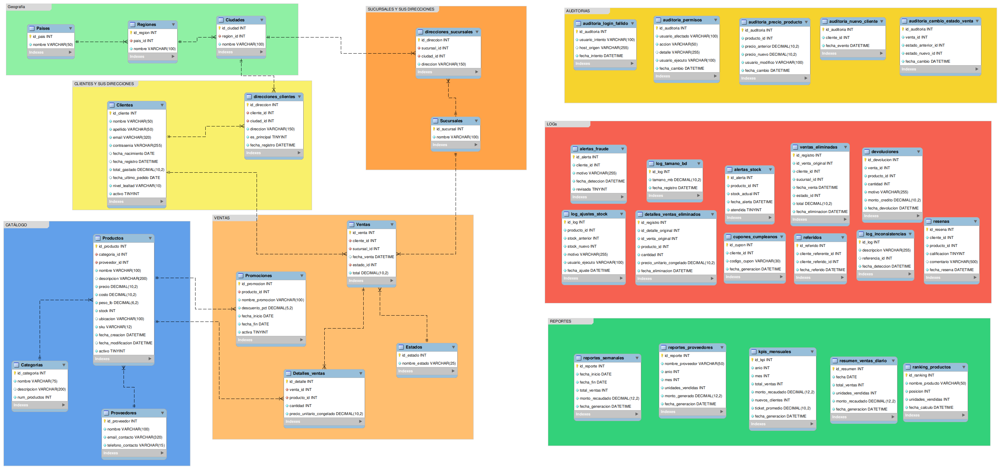

# 🛒 Base de Datos - E-commerce

## Descripción

Base de datos relacional para una tienda en línea que opera en Guatemala y Colombia: catálogo, geografía, sucursales, clientes, ventas, promociones, y toda la capa de automatización y seguridad (triggers, eventos programados, procedimientos almacenados y control de acceso por roles) que mantiene el sistema consistente por sí solo.

---

## Diagrama



## Estructura del proyecto

```
BaseDatos_E-commerce/
│
├── 01_Esquema_y_Datos.sql              # DDL: creación de la base de datos y las tablas
├── 01_1_Esquemas_y_Datos.sql           # DML: inserción de los datos de prueba
├── 02_Consultas_Avanzadas.sql          # 20 consultas de negocio
├── 03_Funciones.sql                    # Funciones auxiliares
├── 05_Triggers.sql                     # Triggers de integridad y automatización
├── 06_Eventos.sql                      # Eventos programados
├── 07_Procedimientos_Almacenados.sql   # Procedimientos con la lógica transaccional
├── 04_Seguridad.sql                    # Roles, usuarios, vistas y permisos
│
├── Examples/
│   ├── funciones_ejemplos.sql
│   ├── triggers_ejemplos.sql
│   ├── eventos_ejemplos.sql
│   ├── procedimeintos_ejemplos.sql
│   └── seguridad_ejemplos.SQL
│
└── README.md
```

---

## Cómo clonar y ejecutar

```bash
git clone https://github.com/AlanGomez-Programmer/BaseDatos_E-commerce
cd BaseDatos_E-commerce
```

Abre cada archivo en MySQL Workbench (**File > Open SQL Script**) y ejecútalo completo (⚡ o `Ctrl+Shift+Enter`), respetando el orden de la siguiente sección.

> Requiere MySQL 8.0+ (usa funciones de ventana y roles).

---

## ⚠️ Orden de ejecución

El orden **no es el orden numérico de los archivos** — `04_Seguridad.sql` depende de procedimientos que se crean después, en `07`, así que debe ejecutarse al final:

1. `01_Esquema.sql`
2. `02_Datos.sql`
3. `03_Consultas_Avanzadas.sql`
4. `04_Funciones.sql`
5. `05_Triggers.sql`
6. `06_Eventos.sql`
7. `07_Procedimientos_Almacenados.sql`
8. `08_Seguridad.sql`

Los archivos de `Examples/` son opcionales y se corren después de su script correspondiente, en cualquier momento.

---

## Verificar que todo funcionó

```sql
USE E_commerce;
CALL sp_ObtenerDashboardAdmin();
```

---

## 👨 AUTOR

Programador Full-Stack Jr. Alan Gomez

GitHub: [AlanGomez-Programmer](https://github.com/AlanGomez-Programmer)

LinkedIn: alan-gomez-763163320